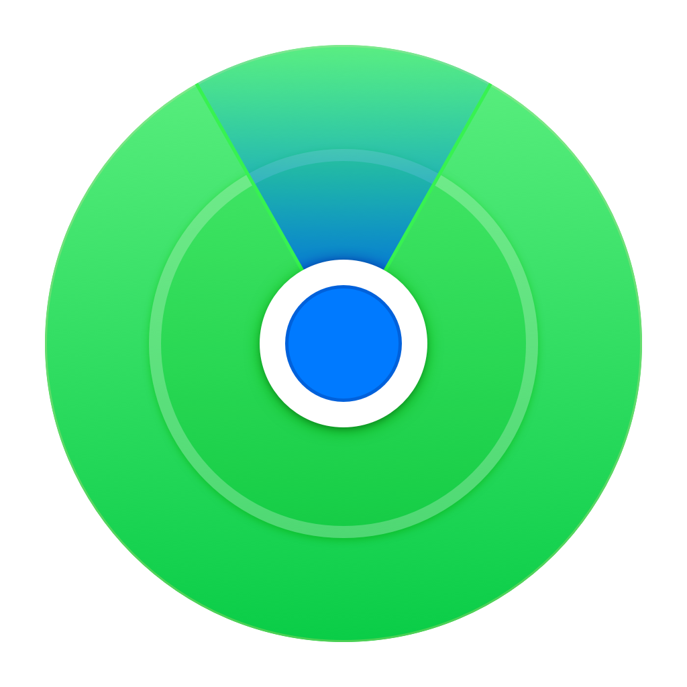

<!-- PROJECT SHIELDS -->
<!--
*** I'm using markdown "reference style" links for readability.
*** Reference links are enclosed in brackets [ ] instead of parentheses ( ).
*** See the bottom of this document for the declaration of the reference variables
*** https://www.markdownguide.org/basic-syntax/#reference-style-links
-->
[![Contributors][contributors-shield]][contributors-url]
[![Forks][forks-shield]][forks-url]
[![Stargazers][stars-shield]][stars-url]
 
[![Gabrielle's LinkedIn][g-linkedin-shield]][gabrielle-linkedin-url]

<!-- PROJECT LOGO -->
  

<!-- <h3 align="center">findmy</h3> -->

 

This project represents the culmination of my journey at the iOS Academy of App Team Carolina. I undertook the challenge of recreating the functionality of Apple's FindMy app using SwiftUI.

 
 

    

    <a href="https://github.com/gabrielleestewart/findmy"><strong>Explore the docs »</strong></a>
     
     
    <a href="https://github.com/gabrielleestewart/findmy/issues">Report Bug</a>
    ·
    <a href="https://github.com/gabrielleestewart/findmy/issues">Request Feature</a>
  

 

<!-- TABLE OF CONTENTS -->

  
Table of Contents

  <ol>
    <li>
      <a href="#about-the-project">About The Project</a>
      <ul>
      <ul>
        <li><a href="#What-it-does">What it does</a></li>
      </ul>
      <ul>
        <li><a href="#Observable-Objects-and-Combine-Framework">Observable Objects and Combine Framework</a></li>
      </ul>
      <ul>
        <li><a href="#MapKit-Integration">MapKit Integration</a></li>
      </ul>
      <ul>
        <li><a href="#Challenges">Challenges</a></li>
      </ul>
      <ul>
        <li><a href="#Accomplishments">Accomplishments</a></li>
      </ul>
      <ul>
        <li><a href="#What's-next">What's next</a></li>
      </ul>
      <ul>
        <li><a href="#built-with">Built With</a></li>
      </ul>
    </li>
    <li><a href="#acknowledgments">Acknowledgments</a></li>
  </ol>

 

<!-- ABOUT THE PROJECT -->
## About The Project
### What it does

The FindMy SwiftUI Recreation app allows users to track the real-time location of people, devices, and items on an interactive map interface. Leveraging SwiftUI's intuitive syntax, users can effortlessly switch between different tabs to view lists of people, devices, and items, and visualize their locations on the map.

 

### MapKit Integration
Apple's MapKit framework was seamlessly integrated into the app to provide map functionality. Despite the challenges posed by the deprecated initializers and the scarcity of resources on the new features, MapKit proved more accessible and intuitive, especially with its improved support for annotations and map style customization.

 

### Observable Objects and Combine Framework
Observable objects and the Combine framework managed data flow and state within the app. Observable objects facilitated the creation of data models for people, devices, and items, while Combine enabled reactive programming and asynchronous data fetching and updates, ensuring real-time updates and responsiveness.

 

### Challenges

Integrating MapKit into SwiftUI posed initial difficulties due to the deprecated initializers and the lack of comprehensive resources on the new SwiftUI-compatible features. Overcoming these obstacles required careful experimentation, reliance on the Apple Developer website, and thorough examination of the WWDC 2023 "Meet MapKit" page. While the improved SwiftUI support for MapKit was a step forward, adapting to the changes and finding workarounds for deprecated features demanded time and patience.

 

### Accomplishments

##### Functional Map Annotations
Implemented functional map annotations that provide seamless navigation to each person's detail view directly from the map. This feature enhances user experience by allowing easy access to detailed information about individuals within the app.

##### Editable Location Nicknames
Enabled users to assign customizable nicknames to locations, providing a personalized touch to their experience. This feature allows users to associate meaningful names with specific locations, enhancing usability and convenience.

##### User Location Integration
Successfully integrated user location functionality, enabling the app to display the user's current location on the map. This feature enhances situational awareness and provides users with valuable context within the app.

##### Real-time Location Updates
Implemented real-time location updates for people, devices, and items, ensuring that the displayed information remains accurate and up-to-date. This feature leverages background location tracking to provide users with timely and relevant location information.

##### Removal of People, Devices, and Items
Implemented functionality to remove people, devices, and items from the app, allowing users to manage their lists effectively. This feature enhances user control and flexibility, enabling users to tailor their experience according to their preferences and needs.

 

### What's next

Looking ahead, plans include enhancing the app by implementing features such as notifications for location updates, advanced user authentication, and further customization options for the map interface. Additionally, optimization of performance and refinement of the user interface for an even better user experience are on the horizon.

 

### Built With

[![Swift][Swift]][Swift-url]
[![Swift UI][SwiftUI]][SwiftUI-url]
[![XCode][XCode]][XCode-url]

(<a href="#readme-top">back to top</a>)

<!-- ACKNOWLEDGMENTS -->
## Acknowledgments

[Shoutout to App Team Carolina!](https://appteamcarolina.com)

(<a href="#readme-top">back to top</a>)

<!-- MARKDOWN LINKS & IMAGES -->
<!-- https://www.markdownguide.org/basic-syntax/#reference-style-links -->
[contributors-shield]: https://img.shields.io/github/contributors/gabrielleestewart/findmy.svg?style=for-the-badge
[contributors-url]: https://github.com/gabrielleestewart/findmy/graphs/contributors
[forks-shield]: https://img.shields.io/github/forks/gabrielleestewart/findmy.svg?style=for-the-badge
[forks-url]: https://github.com/gabrielleestewart/findmy/network/members
[stars-shield]: https://img.shields.io/github/stars/gabrielleestewart/findmy.svg?style=for-the-badge
[stars-url]: https://github.com/gabrielleestewart/findmy/stargazers
[issues-shield]: https://img.shields.io/github/issues/gabrielleestewart/findmy.svg?style=for-the-badge
[issues-url]: https://github.com/gabrielleestewart/findmy/issues
[g-linkedin-shield]: https://img.shields.io/badge/linkedin-gabrielle-white?style=for-the-badge&logo=linkedin&labelColor=%230A66C2
[gabrielle-linkedin-url]: https://linkedin.com/in/gabrielleestewart

<!-- [product-screenshot]: Slides/title.jpeg -->
[Swift]: https://img.shields.io/badge/swift-%23F05138?style=for-the-badge&logo=swift&logoColor=white
[Swift-url]: https://developer.apple.com/swift/
[SwiftUI]: https://img.shields.io/badge/swiftui-%233F8EF4?style=for-the-badge&logo=swift&logoColor=white
[SwiftUI-url]: https://developer.apple.com/xcode/swiftui/
[XCode]: https://img.shields.io/badge/Xcode-%23147EFB?style=for-the-badge&logo=xcode&logoColor=white
[XCode-url]: https://developer.apple.com/xcode/
